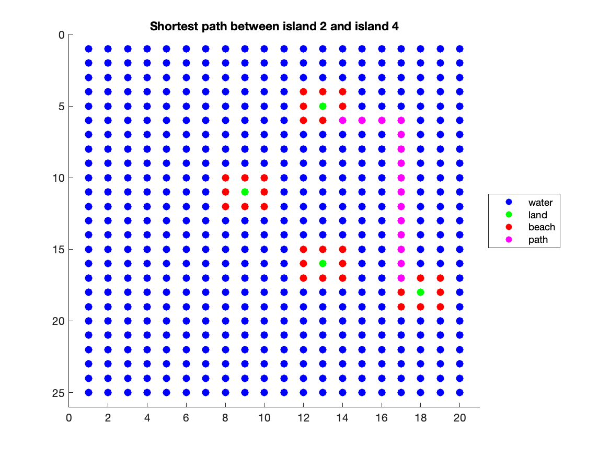

# Exercises

* _KD-Tree_:
This implementation of the KD-Tree performs the following operations: building a tree, inserting into a tree, and finding the nearest neighbor to a point. The code can be run by running the following command. Please replace <points#.txt> with one of the points files in the folder.
```
$ g++ -std=c++14 test_kd_tree.cpp -g -o kdtree
$ ./kdtree <points#.txt>
```
* _Islands_:
Matlab implementation of a collection of algorithms, used to solve the following problems:
  1. Count the number of strongly connected components (BFS)
  2. Find the shortest path between two connected components (BFS)
  
